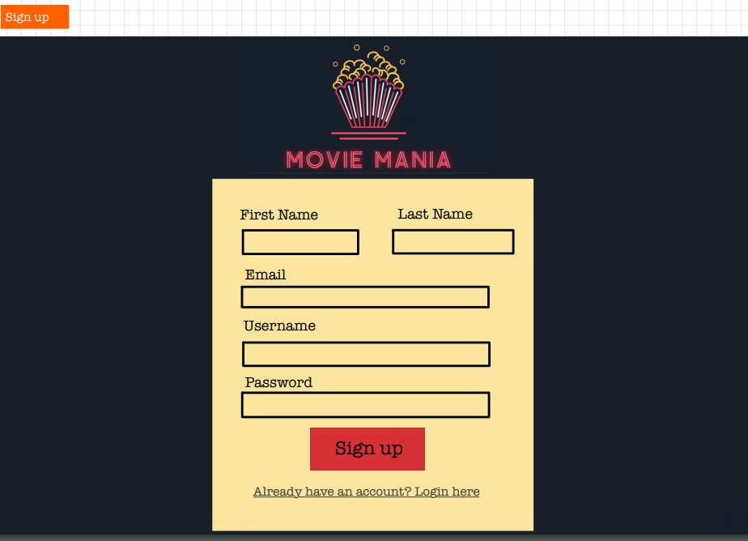
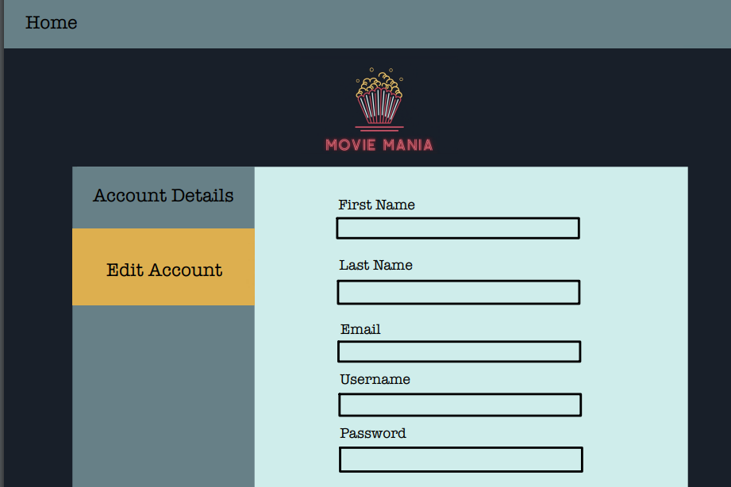

# Customer Graphical Human Interface

## Main Page
When a user first visits the website, they will have a choice of either signing up or logging in.

User will be able to either click a link that edirects them to the login page or click a link that redirects them to the login pag.

## Sign Up Form

User will be able to add their firstname, last name, email, username, and password.

## Login Page

User will be able to input their username and password to login and us features that are only available to logged in users.

## Detail Page

When a user clicks on a movie card, it will take them to the movie detail page and will populate the page with the chosen movie card. The detail card will include the movie poster, description, title, whicj streaming service to use to watch the movie on, and the ability to bookmark

## Bookmarks Page

This page will display all the movies that the user has bookmarked and will order them by the order of which they were bookmarked. User will also be able to delete bookmarks

## Account Page

User will be able to see their Account information such as first name, last name, email, username, and password

## Account Edit Page

User will be able to to edit their first name, last name, email, username, and password

